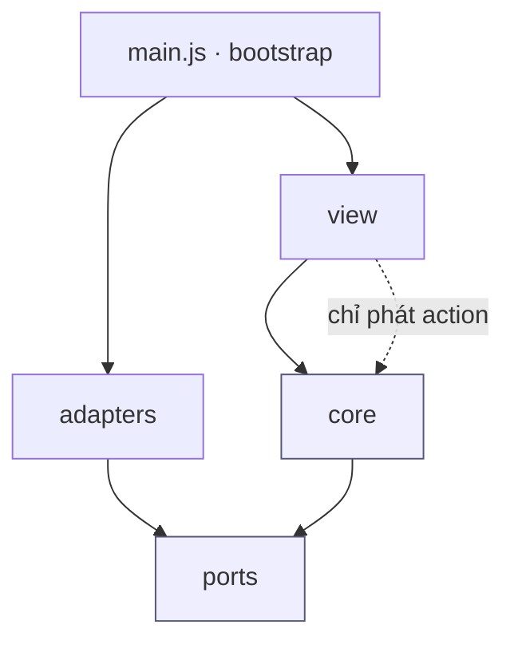
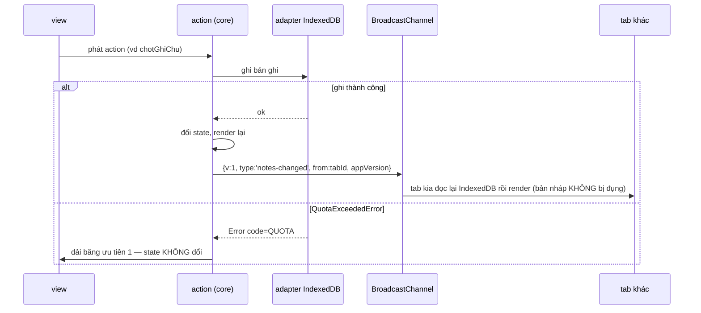
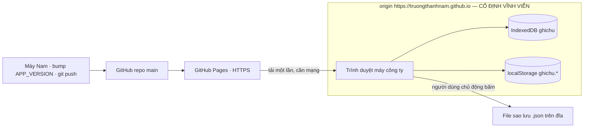

# Architecture Spine — Ghi chú hàng ngày

## Design Paradigm

**Store một chiều, bọc trong ports-and-adapters.**

Một khối `state` duy nhất trong bộ nhớ. Mọi thay đổi đi qua một *action*; view là hàm thuần của
state. Lõi (state, action, lọc, bỏ dấu, gộp sao lưu) không biết gì về DOM, IndexedDB hay `window` —
nó nói chuyện với thế giới qua *port*, và *adapter* là thứ duy nhất chạm vào trình duyệt.

| Tầng | Thư mục | Được phép biết |
| --- | --- | --- |
| **core** | `app/core/` | Chỉ JavaScript thuần. Không DOM, không API trình duyệt |
| **ports** | `app/ports/` | Chữ ký hàm mà core cần thế giới cung cấp |
| **adapters** | `app/adapters/` | IndexedDB, localStorage, BroadcastChannel, File, `navigator.storage` |
| **view** | `app/view/` | DOM. Đọc state, phát action. Không bao giờ tự đổi state |
| **bootstrap** | `app/main.js` | Nơi duy nhất nối adapter thật vào port |



Mũi tên là **hướng được phép import**. `core/` và `ports/` không có mũi tên nào đi ra ngoài — đó là
điều làm chúng chạy được trong Vitest mà không cần trình duyệt. **Không có cạnh `adapters → view`:**
adapter không bao giờ gọi thẳng vào giao diện, kể cả để báo lỗi (AD-8).

## Invariants & Rules

### AD-1 — Một đường duy nhất đổi state

- **Binds:** tất cả
- **Prevents:** hai vùng UI cùng sửa cùng một dữ liệu theo hai cách, rồi lệch nhau — đúng kiểu hỏng
  mà bảng trạng thái FR-14 sẽ không bao giờ khớp lại được
- **Rule:** state chỉ đổi bên trong một action ở `core/`. View không được ghi vào state, không được
  giữ state riêng của nó, và không được sửa DOM ngoài lượt render. Adapter không được đổi state —
  nó trả dữ liệu (hoặc ném lỗi) về cho action.

### AD-2 — Hướng phụ thuộc một chiều, core không biết trình duyệt

- **Binds:** tất cả
- **Prevents:** logic dễ sai nhất (gộp sao lưu FR-16, bỏ dấu FR-12, mô hình điều kiện FR-14) bị
  khóa chặt vào IndexedDB nên không test được, và chỉ lộ ra khi dùng thật
- **Rule:** `core/` và `ports/` không được import bất cứ gì từ `adapters/`, `view/`, hay chạm tới
  `window`/`document`/`indexedDB`. Chỉ `main.js` được nối adapter thật vào port. Mọi module trong
  `core/` phải có test Vitest chạy được ở Node, không giả lập trình duyệt.

### AD-3 — Ba tầng phạm vi state, không tầng nào lấn tầng nào

- **Binds:** FR-3, FR-10, FR-14, FR-20, A-3, A-6, `[OVERRIDE-1]`
- **Prevents:** hai kiểu hỏng ngược nhau — bản nháp của tab này bị tab kia xóa mất (FR-20 cấm), và
  trạng thái lẽ ra phù du lại sống dai qua lần tải trang sau (A-3, A-6 cấm)
- **Rule:** mọi mẩu state thuộc **đúng một** trong ba tầng, và tầng quyết định nó nằm ở đâu:

  | Tầng | Gồm những gì | Nằm ở đâu | Đồng bộ đa tab |
  | --- | --- | --- | --- |
  | **A · Bền, dùng chung** | Ghi chú | IndexedDB `ghichu`, store `notes` | Có (AD-7) |
  | **B · Bền, riêng tab** | Bản nháp | IndexedDB `ghichu`, store `drafts`, khóa `tabId` | **Không bao giờ** |
  | **B′ · Bền, dùng chung, không phải ghi chú** | Theme, mốc sao lưu, cờ persist bị từ chối | `localStorage` `ghichu.theme` · `ghichu.lastBackupAt` · `ghichu.persistDenied` | Có (AD-7) |
  | **C · Phù du** | Điều kiện đang bật, mẩu đang mở rộng, mẩu đang sửa, dải băng đang hiện | Chỉ RAM | Không |

  **Không một ghi chú nào được lưu ở `localStorage`.** **Không một mẩu state tầng C nào được ghi
  xuống bất kỳ kho bền nào** — đó là thứ làm A-3 và A-6 đúng theo thiết kế chứ không phải tình cờ.
  `localStorage` chỉ được mang đúng ba key liệt kê ở trên.

  **Bản nháp ở trong IndexedDB chứ không phải `localStorage`, và đó là chủ ý:** chỉ IndexedDB có
  transaction, nên việc một tab **nhận** một bản nháp bỏ lại mới làm được nguyên tử. Bản ghi
  `drafts` là `{ tabId, text, heartbeat }`, với `heartbeat` là chuỗi ISO được tab đang sống cập
  nhật mỗi `DRAFT_BEAT_MS`. Quy tắc khởi động, **toàn bộ nằm trong một transaction `readwrite`
  duy nhất**:
  1. Đọc `tabId` từ `sessionStorage`; không có thì sinh bằng `crypto.randomUUID()`. Rồi **xin giữ
     khóa sống** `ghichu.tab.<tabId>` bằng `navigator.locks` với `ifAvailable`, và giữ nó suốt đời
     tab. Giữ được → không tài liệu nào khác đang cầm danh tính này. Không giữ được → một tab khác
     **thật sự đang sống** với cùng `tabId` (Nam nhân đôi tab, vì `sessionStorage` được sao chép
     theo) → sinh `tabId` mới, giữ khóa của nó, và ghi nó vào `sessionStorage`.

     **Không dùng `heartbeat` để làm phép này** — đó là bản đầu, và nó sai: `sessionStorage` sống
     sót qua một lần **tải lại**, nên tab vừa tải lại đọc ra đúng `tabId` cũ và thấy một bản ghi
     mà **chính nó** vừa viết vài giây trước. Nó kết luận mình bị nhân đôi và bỏ rơi bản nháp của
     chính mình. Vì nhịp tim đập mỗi `DRAFT_BEAT_MS` còn ngưỡng là `DRAFT_STALE_MS`, **mọi** lần
     tải lại đều rơi vào cửa sổ đó, tức FR-3 hỏng ở đúng ca thường gặp nhất. Khóa thì không suy
     đoán: trình duyệt nhả nó khi tài liệu giữ nó biến mất, kể cả khi tab bị đóng đột ngột.
  2. Có bản ghi của chính `tabId` (đã chốt ở bước 1) → dùng nó, **bất kể** `heartbeat` mới hay cũ.
  3. Không có → **nhận** bản ghi bỏ lại có `heartbeat` cũ nhất và đã quá `DRAFT_STALE_MS`: ghi lại
     dưới `tabId` của mình và xóa bản ghi cũ, trong cùng transaction đó. Nhận **nhiều nhất một**.
  4. Xóa mọi bản ghi `drafts` có `text` rỗng.

  Vì cả bốn bước nằm trong một transaction, hai tab khởi động cùng lúc **không thể** cùng nhận một
  bản nháp — cái thứ hai thấy nó đã biến mất. Và vì chỉ nhận bản ghi đã **hết nhịp tim**, một tab
  đang gõ dở không bao giờ bị tab khác lấy mất bản nháp (FR-20).

### AD-4 — Thời điểm tạo là giờ tại chỗ, và giờ tại chỗ là khóa sắp xếp

- **Binds:** FR-2, FR-6, FR-7, FR-13, FR-16, NT-4
- **Prevents:** nạp file sao lưu trên máy đặt múi giờ khác làm ghi chú trượt sang ngày khác — cái
  neo của UJ-2 gãy trong im lặng; và `query.js` với `backup.js` sắp xếp theo hai kiểu khác nhau
- **Rule:** `createdAt` là chuỗi ISO-8601 **có offset**, ví dụ `2026-09-03T16:40:12+07:00`, gán một
  lần lúc chốt và không bao giờ đổi. Hai khóa dẫn xuất, sinh bởi hai hàm thuần duy nhất trong
  `core/time.js`:
  - `localStamp(note) = createdAt.slice(0, 19)` → `2026-09-03T16:40:12` — **khóa sắp xếp duy nhất**
  - `localDate(note) = createdAt.slice(0, 10)` → `2026-09-03` — **khóa lọc ngày duy nhất**

  Sắp xếp và lọc **luôn** so sánh chuỗi trên hai khóa này. **Cấm** so sánh chuỗi trên chính
  `createdAt` (offset khác nhau làm thứ tự sai), và **cấm** `new Date(createdAt)` cho bất kỳ mục
  đích hiển thị, sắp xếp hay lọc nào. "Hôm nay" là `localDate` dựng từ giờ máy hiện tại, đem so
  sánh chuỗi.
- **Ngoại lệ duy nhất là phép trừ ngày**, thứ mà FR-17 cần để nói "cách đây tám ngày": hàm
  `daysBetween(dateA, dateB)` trong `core/time.js` nhận **hai chuỗi `yyyy-MM-dd`** và trả về số
  ngày lịch giữa chúng. Nó là nơi duy nhất trong toàn bộ mã được phép dựng `Date`, và nó dựng ở
  UTC giữa trưa để phép trừ không bị giờ mùa hè làm lệch một ngày. Không hàm nào khác được đụng
  tới `Date` cho việc gì liên quan tới `createdAt`.

### AD-5 — Bỏ dấu là dữ liệu dẫn xuất, sinh từ một hàm duy nhất

- **Binds:** FR-12, NFR-6
- **Prevents:** lúc ghi bỏ dấu một kiểu, lúc gõ tìm kiếm bỏ dấu kiểu khác → gõ đúng mà không ra kết
  quả, và không có cách nào phát hiện ngoài việc dùng thật
- **Rule:** một hàm thuần `fold(text)` ở `core/fold.js` là nơi **duy nhất** làm việc này, dùng cho
  cả hai đầu. Thứ tự bắt buộc: map `đ→d` / `Đ→D` **trước**, rồi `normalize('NFD')`, rồi bỏ `\p{M}`,
  rồi `toLowerCase()` — `đ` (U+0111) không có phân rã chuẩn nên NFD không đụng tới nó; đảo thứ tự
  là sai.
- **Bất biến kèm theo, phải có test riêng:** `fold(text).length === text.length` cho mọi chuỗi
  tiếng Việt, và ký tự thứ `i` của kết quả tương ứng đúng ký tự thứ `i` của đầu vào. EXPERIENCE.md
  đòi tô nền chỗ khớp **bên trong chữ có dấu** (`phan quyen` khớp và tô đúng `Phân quyền`), nên vị
  trí khớp tìm được trên `textFolded` phải dùng thẳng được trên `text`. Mất tính chất này thì phần
  tô sẽ lệch dần từng ký tự một, và không có triệu chứng nào ngoài "nhìn hơi sai".

### AD-6 — Toàn bộ ghi chú nằm trong RAM; lọc và tìm không chạm ổ đĩa

- **Binds:** FR-12, FR-13, FR-14, NFR-2
- **Prevents:** mỗi ký tự gõ vào ô tìm kiếm bắn một truy vấn bất đồng bộ, kết quả về sai thứ tự và
  lưới giật — trần 200 ms của NFR-2 gãy đúng lúc có người đang đứng chờ
- **Rule:** lúc khởi động đọc toàn bộ `notes` vào một mảng trong state, sắp xếp giảm dần theo
  `localStamp`. Lọc và tìm là phép quét mảng **đồng bộ** trên `textFolded` và `localDate`. Đọc
  IndexedDB chỉ xảy ra ở đúng hai chỗ: lúc khởi động, và khi nhận tin BroadcastChannel (AD-7).
  **Mảng trong RAM không bao giờ là nguồn sự thật cho một thao tác ghi** — mọi phép ghi, kể cả gộp
  file nạp (AD-11), đọc và ghi trên IndexedDB, rồi mới nạp lại RAM.

### AD-7 — Đồng bộ đa tab: một hình dạng bản tin, và chỉ ghi chú mới đồng bộ

- **Binds:** FR-20, FR-3, UJ-1
- **Prevents:** (a) tab này ghi mà tab kia không biết, rồi thao tác sau của tab kia dựng lại state
  cũ đè lên; (b) tab kia "nạp lại state" và xóa mất bản nháp đang gõ dở ở tab này — đúng thứ FR-20
  cấm bằng chữ
- **Rule:** đúng một kênh, `BroadcastChannel('ghichu')`, và đúng một hình dạng bản tin:

  ```js
  { v: 1, type: 'notes-changed' | 'session-changed', from: <tabId>, appVersion: <APP_VERSION> }
  ```

  Đúng bốn trường và **đúng hai** giá trị `type`; không có loại tin nào khác. Bản tin **không bao
  giờ mang nội dung** — tab nhận luôn đọc lại từ kho bền. Tab bỏ qua tin có `from` bằng `tabId` của
  chính nó. `notes-changed` phát sau **mọi** lần ghi thành công vào store `notes` (chốt, sửa, xóa,
  nạp lại). `session-changed` phát khi theme hoặc mốc sao lưu đổi. `appVersion` khác của mình →
  AD-21. **Bản nháp không bao giờ phát tin và không bao giờ bị tab khác đọc hay ghi** khi tab chủ
  của nó còn nhịp tim (AD-3 tầng B) — đó là cách FR-3 "bản nháp xuất hiện lại nguyên trạng" và
  FR-20 "tab kia không xóa mất bản nháp" cùng đúng một lúc. Cấm khóa tab và cấm dải băng "đóng tab
  này".

### AD-8 — Ghi thất bại thì không bao giờ giả vờ đã lưu

- **Binds:** FR-3, FR-5, FR-10, FR-11, FR-19, NFR-3
- **Prevents:** giao diện tỏ ra đã lưu xong trong khi chữ chưa xuống đĩa — kiểu hỏng tệ nhất mà
  brief đã ghi nhận ở Microsoft Sticky Notes
- **Rule:** hai luồng, và **phải phân biệt được chúng**:
  - **Thao tác đổi sự tồn tại** (chốt, xóa, nạp file): **ghi trước, đổi state sau**. Adapter ném
    lỗi thì action dừng, state giữ nguyên, mẩu giấy không xuất hiện.
  - **Tự lưu nội dung đang gõ** (bản nháp FR-3, sửa ghi chú FR-10): state trong RAM đổi **ngay**
    theo từng phím (nếu không thì không gõ được), phép ghi đi sau với debounce `AUTOSAVE_MS = 400`
    — nằm trong trần ≤ 1 giây của FR-3. Ghi thất bại thì **không hoàn tác chữ đã gõ**; dải băng
    hiện và **ở lại cho tới khi một phép ghi sau đó thành công**. Chữ vẫn nằm trên màn hình, và
    dải băng là thứ nói rằng nó chưa an toàn.

  **Hẹn debounce không bao giờ được sống lâu hơn thứ nó định ghi.** Mỗi mục tiêu tự lưu (bản nháp,
  và mỗi ghi chú đang sửa) mang một số đếm `seq` tăng dần trong state; hẹn nào nổ ra mà `seq` của
  nó không còn là `seq` hiện tại thì **bị bỏ, không ghi**. Ngoài ra, `chotGhiChu` và `xoaGhiChu`
  **phải hủy hẹn đang treo của mục tiêu đó trước khi làm gì khác**. Và `chotGhiChu` ghi bản ghi
  `notes` mới **cùng với** việc làm rỗng bản ghi `drafts` của tab này **trong một transaction duy
  nhất** — nếu không, một hẹn cũ nổ sau lúc chốt sẽ hồi sinh bản nháp đã chốt và Nam chốt nó lần
  thứ hai thành một ghi chú trùng nội dung mà `id` lại khác, thứ mà phép gộp theo `id` của AD-11
  không bao giờ dọn được.

  Lỗi từ adapter đi ngược lên action rồi ra view. **Adapter không bao giờ gọi thẳng vào view.**
  Không `console.error` thay cho báo người dùng, không nuốt lỗi, không telemetry (NFR-5).

### AD-9 — Origin cố định, và mọi thứ đều mang tiền tố

- **Binds:** NFR-8
- **Prevents:** một project site khác của cùng tài khoản GitHub va tên vào kho dữ liệu này
- **Rule:** origin sản xuất là `https://truongthanhnam.github.io`, app phục vụ tại `/bmad/`, từ
  nhánh `main` thư mục gốc. Địa chỉ này **không được đổi**. Tên IndexedDB là `ghichu`, tên
  BroadcastChannel là `ghichu`, và mọi key `localStorage`/`sessionStorage` mang tiền tố `ghichu.` —
  không có ngoại lệ.
- **Rủi ro đã biết, chấp nhận có ý thức:** origin của trình duyệt **không tính đường dẫn**, nên mọi
  project site khác của tài khoản này dùng chung origin và **về nguyên tắc đọc/ghi được** cùng
  IndexedDB, cùng `localStorage` và cùng `BroadcastChannel`. Tiền tố chỉ ngăn **va chạm tên**, không
  ngăn truy cập. Đây là cái giá của việc đặt app trong repo BMAD thay vì một tên miền riêng; nếu về
  sau host một trang khác có mã của người lạ trên cùng tài khoản, đây là chỗ phải xem lại đầu tiên.

### AD-10 — Xin lưu trữ bền, và cảnh báo bằng ngưỡng thật sự kích hoạt được

- **Binds:** FR-19, FR-17, NFR-3
- **Prevents:** trình duyệt lặng lẽ dọn dữ liệu best-effort khi máy hết đĩa; và một ngưỡng cảnh báo
  không bao giờ nổ (PRD Open Question 3)
- **Rule:** gọi `navigator.storage.persist()` ở mỗi lần khởi động cho tới khi nó trả `true` —
  Chromium tự quyết theo mức tương tác nên lần mở đầu tiên chính là lúc dễ bị từ chối nhất, thử một
  lần rồi bỏ là sai. Bị từ chối thì ghi `ghichu.persistDenied` và ngưỡng dòng nhắc sao lưu FR-17 hạ
  từ 7 ngày xuống **3 ngày**. Sau mỗi lần chốt, sửa hoặc nạp lại, đọc `navigator.storage.estimate()`
  và cảnh báo trước ngưỡng khi **một trong hai** điều kiện đúng:
  `usage / quota ≥ 0.80` **hoặc** `quota - usage < 50 MB`.
  Hai vế là bắt buộc: quota mỗi origin trên Chromium là một phần lớn dung lượng ổ, nên riêng vế 80%
  gần như không bao giờ nổ; còn `QuotaExceededError` thật thì đến từ áp lực đĩa toàn máy, lúc
  `usage/quota` vẫn rất thấp. `estimate()` là **ước lượng có đệm chống fingerprinting**, không phải
  số đo chính xác — nó dùng để cảnh báo sớm, không bao giờ dùng để quyết định có ghi hay không.
  Đường phát hiện thật vẫn là bắt `QuotaExceededError` theo AD-8.

### AD-11 — File sao lưu là hợp đồng có phiên bản; nạp là gộp, và gộp là nguyên tử

- **Binds:** FR-15, FR-16, FR-17, FR-18, UJ-3
- **Prevents:** bản app sau này không đọc được file của hôm nay; một file lạ ghi đè lên kho đang có;
  và một lần nạp hỏng giữa chừng để lại nửa file trên đĩa trong khi giao diện nói không có gì đổi
- **Rule:** hình dạng file là
  `{ schemaVersion: 1, exportedAt: <ISO-8601 có offset>, notes: [{ id, createdAt, text }] }`.
  `localDate` và `textFolded` **không** có trong file — chúng là dẫn xuất, tính lại lúc nạp theo
  AD-4 và AD-5. Tên file `ghi-chu-hang-ngay-YYYY-MM-DD.json`.

  Nạp đi qua **hai pha tách bạch**:
  1. **Kiểm tra toàn bộ trước khi ghi.** `schemaVersion` khác 1, JSON hỏng, thiếu trường bắt buộc,
     `createdAt` sai dạng ISO có offset, `id` trùng nhau trong file, hoặc `text` vượt
     `MAX_NOTE_CHARS` ở **bất kỳ** ghi chú nào → **từ chối cả file, không ghi một byte nào**.
  2. **Ghi trong MỘT transaction IndexedDB duy nhất.** Toàn bộ hoặc không gì cả. Transaction hỏng
     giữa chừng (kể cả `QuotaExceededError`) thì IndexedDB tự cuộn ngược, và AD-8 áp dụng nguyên vẹn.

  Gộp là theo `id`: đã có thì bỏ qua, chưa có thì thêm. **Không bao giờ xóa, không bao giờ ghi đè.**
  `backup.js` trả về `{ added, skipped }` — hai con số thật mà microcopy "Đã nạp N ghi chú, bỏ qua M
  ghi chú đã có" bắt buộc phải có. `ghichu.lastBackupAt` được cập nhật ở **cả hai** đường: lúc xuất
  file thành công (giá trị là `exportedAt` vừa dựng), và lúc nạp file (giá trị `exportedAt` trong
  file, chỉ khi nó mới hơn giá trị đang có — đó là cách FR-17 khôi phục được mốc nhắc trên máy
  mới). Cả hai đường đều phát `session-changed` (AD-7).

### AD-12 — Không có bước build, và chỉ chạy trên HTTPS

- **Binds:** tất cả
- **Prevents:** một toolchain không ai đụng tới trong sáu tháng rồi không dựng lại được; và
  `crypto.randomUUID` biến mất trong im lặng vì trang được mở ngoài secure context
- **Rule:** `index.html` nạp thẳng ES modules; deploy = `git push`. Không bundler, không transpile,
  không CSS preprocessor, **không thư viện chạy lúc runtime** — kể cả một thư viện nhỏ.
  `package.json` tồn tại **chỉ** để chạy Vitest trên `core/`, và không có dependency nào đi vào mã
  sản phẩm. App **chỉ chạy trong secure context**: production là HTTPS của GitHub Pages, phát triển
  cục bộ là một HTTP server ở `localhost`. **Cấm mở bằng `file://`** — ES modules vỡ vì CORS và
  `crypto.randomUUID` không tồn tại ngoài secure context.
- **Sau khi trang tải xong, app không phát một request mạng nào.** Cấm webfont từ Google Fonts hay
  bất kỳ CDN nào, cấm ảnh/icon ngoài, cấm `fetch` tới bất cứ đâu. Mọi phông chữ là font hệ thống,
  mọi icon là ký tự hoặc SVG nội tuyến. Đây là điều làm NFR-5 ("dữ liệu không rời máy") thành thứ
  kiểm chứng được bằng tab Network chứ không phải một lời hứa.

### AD-13 — Hình dạng bản ghi ghi chú là hợp đồng, và chỉ được nới ra

- **Binds:** tất cả, đặc biệt FR-2, FR-12, FR-13, NFR-3
- **Prevents:** hai module hiểu bản ghi khác nhau; và mã cũ trong một tab để mở cả ngày đọc phải
  bản ghi do mã mới viết rồi hỏng
- **Rule:** một bản ghi trong object store `notes` có **đúng năm trường**, không hơn:

  | Trường | Kiểu | Nguồn |
  | --- | --- | --- |
  | `id` | string | `crypto.randomUUID()`, sinh lúc chốt, bất biến |
  | `createdAt` | string | ISO-8601 có offset, bất biến (AD-4) |
  | `localDate` | string `yyyy-MM-dd` | **dẫn xuất** từ `createdAt` — có index, phục vụ FR-13 |
  | `text` | string | nội dung thuần, `≤ MAX_NOTE_CHARS` |
  | `textFolded` | string | **dẫn xuất** từ `text` qua `fold()` (AD-5) |

  Hai trường dẫn xuất được **tính lại ở mọi lần ghi** và không bao giờ được sửa riêng lẻ. Trong
  vòng đời `schemaVersion: 1`, **cấm xóa hoặc đổi tên một trường**; chỉ được thêm trường mới có giá
  trị mặc định an toàn khi vắng mặt. Mọi module đọc bản ghi phải chịu được trường lạ mà nó không
  biết.

### AD-14 — Trần là ràng buộc của core, chặn ở mọi cửa vào

- **Binds:** FR-12, FR-18, A-11, A-12, NT-3
- **Prevents:** trần 20.000 ký tự chặn ở ô soạn thảo nhưng không chặn ở chế độ sửa hay ở file nạp;
  và trần 50 kết quả làm mất luôn con số thật mà hàng chip cần
- **Rule:** mọi hằng số ngưỡng nằm ở `core/limits.js` và **chỉ ở đó**: `MAX_NOTE_CHARS = 20000`,
  `MAX_RESULTS = 50`, `COLLAPSED_LINES = 3`, `BACKUP_NUDGE_DAYS = 7` (3 khi `persistDenied`),
  `AUTOSAVE_MS = 400`, `DRAFT_BEAT_MS = 10000`, `DRAFT_STALE_MS = 30000`,
  `QUOTA_WARN_RATIO = 0.80`, `QUOTA_WARN_FREE_BYTES = 50 * 1024 * 1024`, và `APP_VERSION` (AD-21).
  - **Trần độ dài** được kiểm ở `core/`, tại **cả ba** cửa vào: chốt bản nháp, sửa ghi chú, và
    kiểm tra file nạp (AD-11). Vượt trần → lỗi `TOO_LONG`, không cắt im lặng.
  - **Trần kết quả:** `query.js` trả `{ items, total }` — `items` đã cắt còn `MAX_RESULTS`, `total`
    là **số khớp thật, không cắt**. View lấy `total` cho hàng chip và cho dòng "còn nhiều hơn".
    Cấm view tự đếm `items.length` rồi gọi đó là số kết quả.

### AD-15 — Điều kiện là một khối duy nhất; "hôm nay" là vắng mặt của điều kiện

- **Binds:** FR-6, FR-12, FR-13, FR-14, NT-3
- **Prevents:** hai chỗ trong view mỗi chỗ giữ một nửa bộ điều kiện, rồi bảng trạng thái chuẩn
  nghiệm thu ở §5.4 của PRD không bao giờ khớp
- **Rule:** điều kiện là **một** giá trị trong state, hình dạng
  `{ keyword: string | null, date: 'yyyy-MM-dd' | null }`. Khung nhìn mặc định là
  `{ keyword: null, date: null }` — nó là **vắng mặt của điều kiện, không phải một điều kiện
  "hôm nay"**; `query.js` tự lọc theo `localDate` hôm nay khi và chỉ khi cả hai trường đều `null`.
  Có ít nhất một điều kiện thì "hôm nay" **không** tham gia phép giao. Chuỗi ngày gõ dở, sai định
  dạng thì `date` vẫn giữ giá trị cũ và dòng ghi chú **không đổi** — lỗi định dạng là chuyện của
  view. Đúng một action `datDieuKien(partial)` được đổi khối này, và đúng một action
  `xoaHetDieuKien()` đưa nó về `{null, null}`; action `chotGhiChu` gọi `xoaHetDieuKien()` như bước
  đầu tiên của nó (FR-14).

### AD-16 — Im lặng khi thành công là ràng buộc kiến trúc, không phải gu thẩm mỹ

- **Binds:** FR-3, FR-4, FR-9, FR-10, FR-15, và toàn bộ Voice-and-Tone của EXPERIENCE.md
- **Prevents:** một chỉ báo "đã lưu" hay "đang lưu" lọt vào vì nó *nghe có vẻ hữu ích* — chính là
  cách sản phẩm này thua
- **Rule:** state **không có** trường nào mang nghĩa "đang lưu", "đã lưu", "chưa chốt" hay "số ký tự
  còn lại", nên view không có gì để vẽ ra. Thao tác **thành công** được phép chạm vào dải băng ở
  **đúng một** trường hợp: kết quả của một lần nạp file (ngoại lệ có chủ đích của FR-16); mọi nguồn
  còn lại của dải băng đều là chuyện xấu (AD-17). Xuất sao lưu, chốt, sửa, xóa đều im lặng tuyệt
  đối. Trạng thái rỗng vẽ **không một chữ nào** (FR-9); ngoại lệ duy nhất là "không có kết quả" khi
  đang có điều kiện bật (AD-15).

### AD-17 — Dải băng có đúng một chủ và một thứ tự ưu tiên

- **Binds:** FR-16, FR-19, FR-20
- **Prevents:** cảnh báo dung lượng, lỗi nạp file và kết quả nạp tranh nhau một ô, và cái đến sau
  xóa mất cái quan trọng hơn
- **Rule:** dải băng là **một** giá trị trong state tầng C, do action đặt, do `view/banner.js` vẽ.
  Bảng dưới đây là **toàn bộ** những gì được phép hiện ở đó, xếp theo ưu tiên giảm dần. Một thông
  báo ưu tiên thấp hơn **không được** thay thông báo đang hiện có ưu tiên cao hơn.

  | # | Nguồn | `code` | Đóng được? |
  | --- | --- | --- | --- |
  | 1 | Mã lệch phiên bản, tab vào chế độ chỉ đọc (AD-21) | `VERSION_SKEW` | Không |
  | 2 | Ghi thất bại vì hết dung lượng | `QUOTA` | Không, cho tới khi một phép ghi sau đó thành công (AD-8) |
  | 3 | Kho dữ liệu không mở được hoặc thao tác DB hỏng | `DB` | Không |
  | 4 | Nạp file thất bại | `BAD_FILE` · `BAD_VERSION` · `TOO_LONG` | Có |
  | 5 | Nội dung vượt trần khi gõ hoặc sửa | `TOO_LONG` | Có |
  | 6 | **Nạp file thành công** — ngoại lệ duy nhất của AD-16 | *(không phải lỗi)* | Có |
  | 7 | Cảnh báo trước ngưỡng dung lượng (AD-10) | *(không phải lỗi)* | Có |

  **Dòng nhắc sao lưu FR-17 không đi qua dải băng** — nó là một dòng riêng ở chân trang. **Lỗi định
  dạng ô ngày không đi qua dải băng** — nó là lỗi tại chỗ của view, không phải lỗi của một thao tác
  ghi. Không có nguồn thứ tám; thêm một nguồn là sửa bảng này trước, không phải sau.

### AD-18 — Mã lỗi là từ vựng chung của core và view

- **Binds:** FR-16, FR-18, FR-19, và bảng microcopy của EXPERIENCE.md
- **Prevents:** adapter ném chuỗi tiếng Anh của trình duyệt rồi view đem hiển thị nguyên văn cho
  Nam
- **Rule:** mọi lỗi băng qua ranh giới đều là `Error` có `code` thuộc tập đóng dưới đây, và
  `core/` ánh xạ `code` sang đúng microcopy trong EXPERIENCE.md. View không bao giờ tự soạn câu chữ
  từ lỗi thô.

  | `code` | Ném ra từ | Ưu tiên dải băng (AD-17) |
  | --- | --- | --- |
  | `VERSION_SKEW` | `core/state.js` khi nhận tin lệch phiên bản | 1 |
  | `QUOTA` | adapter IndexedDB / localStorage | 2 |
  | `DB` | adapter IndexedDB (không mở được, transaction hỏng) | 3 |
  | `BAD_FILE` | `core/backup.js` (JSON hỏng, thiếu trường, `id` trùng, `createdAt` sai dạng) | 4 |
  | `BAD_VERSION` | `core/backup.js` (`schemaVersion` khác 1) | 4 |
  | `TOO_LONG` | `core/limits.js` | 4 khi đến từ file nạp · 5 khi đến từ bàn phím |

  Tập này **đóng**. Một tình huống lỗi mới thì thêm `code` mới vào đây và vào bảng ưu tiên của
  AD-17 **cùng lúc**, không bao giờ tái sử dụng một `code` sẵn có cho nghĩa khác.

### AD-19 — Tab title và theme là hàm của state, không phải hiệu ứng lề

- **Binds:** `[OVERRIDE-1]`, `[OVERRIDE-2]`, FR-6
- **Prevents:** tab title đếm nhầm số mẩu **đang hiển thị** thay vì số ghi chú **của hôm nay** —
  làm bước 2 của UJ-1 nói dối; và một nháy màu sai theme lúc tải trang
- **Rule:** tab title do lượt render tính ra từ state, luôn là **số ghi chú có `localDate` bằng hôm
  nay**, không phụ thuộc điều kiện đang bật (AD-15). Theme đọc từ `ghichu.theme` bằng một đoạn
  script **đồng bộ, nội tuyến trong `<head>`**, đặt thuộc tính lên `<html>` **trước lần vẽ đầu
  tiên** — đây là ngoại lệ duy nhất của AD-2 được phép, và nó phải nằm trong `index.html` chứ không
  phải trong `app/`.

### AD-20 — Sàn accessibility là ràng buộc dựng được, không phải lời khuyên

- **Binds:** Accessibility Floor của EXPERIENCE.md (6 mục), FR-11
- **Prevents:** sàn a11y trôi mất giữa các story vì không story nào nhận nó
- **Rule:** sáu mục của EXPERIENCE.md, mỗi mục có một chỗ dựng cụ thể — không mục nào là "nhớ chú
  ý": **(1)** `outline: none` bị cấm tuyệt đối trong `style.css`; mọi phần tử tương tác dùng token
  focus của DESIGN.md. **(2)** hộp thoại xác nhận xóa **giam focus** trong nó, focus mặc định đặt
  vào `hủy`, và trả focus về đúng nút xóa vừa bấm khi đóng (FR-11). **(3)** mọi điều khiển chỉ có
  ký hiệu — nút `✕` của dải băng, icon lịch — phải mang nhãn chữ. **(4)** tương phản ≥ 4.5:1 được
  bảo đảm bằng cách `style.css` **chỉ dùng token màu của DESIGN.md**, không có giá trị màu viết
  thẳng ở bất kỳ đâu — token là chỗ duy nhất tỉ lệ đã được tính. **(5)** bố cục dùng đơn vị tương
  đối và grid `auto-fill`, không `px` cứng cho chiều rộng vùng chứa, để phóng 200% rớt về một cột
  mà không cắt chữ. **(6)** mọi chuyển động nằm trong một khối `@media (prefers-reduced-motion: no-
  preference)` duy nhất — mặc định là **không có chuyển động**, và chuyển động là thứ được thêm
  vào, không phải thứ bị gỡ ra. Thứ tự tab bám đúng thứ tự DOM; không dùng `tabindex` dương ở bất
  kỳ đâu.

### AD-21 — Mã cũ trong tab mở lâu ngày phải hỏng ồn ào, không hỏng im lặng

- **Binds:** NFR-3 ("ghi chú tồn tại qua cập nhật phiên bản app"), UJ-1
- **Prevents:** Nam để tab mở nhiều ngày, một bản mới được deploy, rồi hai tab chạy hai phiên bản
  mã khác nhau ghi vào cùng một IndexedDB
- **Rule:** **phát hiện lệch phiên bản, không phải phá cache.** Không có bước build thì không có
  cách nào đáng tin để bust cả một đồ thị `import` tĩnh — spine này không giả vờ là có.
  `APP_VERSION` là một hằng trong `core/limits.js`, bump bằng tay ở mỗi lần deploy. Nó đi trong mọi
  bản tin BroadcastChannel (AD-7). Tab nào nhận được `appVersion` **khác** của mình thì lập tức vào
  **chế độ chỉ đọc**: mọi action có ghi bị từ chối với `code = VERSION_SKEW`, hẹn tự lưu bị hủy, và
  dải băng ưu tiên cao nhất hiện lên đề nghị tải lại trang, **không đóng được**. Chỉ-đọc chứ không
  phải chỉ-cảnh-báo, vì mã cũ vẫn ghi được là đường hỏng thật: RAM lỗi thời của nó sẽ đè lên bản
  ghi do mã mới viết. Kết hợp với AD-13 (bản ghi chỉ được nới ra), điều tệ nhất một tab cũ gây ra
  là hiển thị thiếu trường mới cho tới lúc Nam tải lại.
- **Giới hạn đã biết:** một tab chỉ biết mình cũ khi có **tab khác** vừa tải bản mới và phát tin.
  Nếu Nam deploy rồi không mở tab nào mới, tab cũ chạy tiếp mà không biết. Với n = 1 và mỗi lần
  deploy đều do chính Nam bấm, đây là rủi ro chấp nhận được; xem Deferred.

## Consistency Conventions

| Concern | Convention |
| --- | --- |
| Naming | Thư mục và file `kebab-case.js`; hàm/biến `camelCase`; action đặt tên theo việc người dùng làm (`chotGhiChu`, `suaGhiChu`, `xoaGhiChu`, `datDieuKien`, `xoaHetDieuKien`, `napFileSaoLuu`) — dùng đúng từ vựng §4 Glossary của PRD |
| Từ vựng dữ liệu | `note` = ghi chú, `draft` = bản nháp, `condition` = điều kiện, `folded` = đã bỏ dấu. **Cấm chữ `card`** trong mã sản phẩm — nó là hình dạng hiển thị, thuộc về DESIGN.md |
| Định danh | `crypto.randomUUID()`, sinh lúc chốt, bất biến (AD-12 bắt buộc secure context) |
| Ngày & giờ | Lưu ISO-8601 có offset; sắp xếp/lọc trên `localStamp`/`localDate` (AD-4). Hiển thị `HH:mm` ở khung nhìn mặc định, `dd/MM/yyyy HH:mm` khi đang tra cứu |
| Hình dạng lỗi | `Error` có `code` thuộc tập đóng của AD-18; core ánh xạ sang microcopy; view chỉ hiển thị |
| Đổi state | Đổi sự tồn tại: ghi trước, state sau. Tự lưu nội dung: state trước, ghi sau (AD-8). Ghi xong phát BroadcastChannel (AD-7) |
| Cấu hình | Không có trang cài đặt. Mọi hằng số ở `core/limits.js` (AD-14); ngoại lệ duy nhất là theme (AD-19) |
| Nhật ký | Không có. Không telemetry, không `console` thay cho báo người dùng (NFR-5, AD-8) |
| Test | Mọi module `core/` có test Vitest. `adapters/` không có test tự động — chúng được kiểm bằng một danh sách thử tay ngắn ghi trong README, vì chúng mỏng theo thiết kế (AD-2) |

## Stack

| Name | Version |
| --- | --- |
| HTML / CSS / JavaScript (ES modules) | chuẩn hiện hành, không transpile |
| Trình duyệt đáy | Chromium hiện hành (Edge / Chrome, tự cập nhật) trên Windows |
| Lưu trữ ghi chú và bản nháp | IndexedDB — DB `ghichu` version 1, store `notes` + `drafts` |
| Lưu trữ phiên | Web Storage — `localStorage` (bền) + `sessionStorage` (`tabId`), tiền tố `ghichu.` |
| Đồng bộ đa tab | `BroadcastChannel` |
| Hạn mức lưu trữ | `navigator.storage` — `persist()`, `estimate()` |
| Test | Vitest 5.0.0 |
| Hosting | GitHub Pages — repo `TruongThanhNam/bmad`, nhánh `main`, thư mục gốc, HTTPS |

## Structural Seed

```text
bmad/
  index.html          # điểm vào duy nhất; script theme nội tuyến, đồng bộ, trước lần vẽ đầu (AD-19)
  app/
    main.js           # bootstrap — nơi DUY NHẤT nối adapter vào port
    core/             # thuần, test được ở Node
      state.js        #   khối state duy nhất + toàn bộ action
      time.js         #   localStamp, localDate (AD-4)
      fold.js         #   bỏ dấu tiếng Việt (AD-5)
      query.js        #   lọc theo điều kiện, trả {items, total} (AD-14, AD-15)
      backup.js       #   dựng file xuất; kiểm tra và gộp file nạp (AD-11)
      errors.js       #   tập mã lỗi đóng + ánh xạ sang microcopy (AD-18)
      limits.js       #   mọi hằng số ngưỡng + APP_VERSION (AD-14, AD-21)
    ports/            # noteStore · sessionStore · channel · fileIO · quota
    adapters/         # indexeddb.js · localstorage.js · broadcast.js · file.js · quota.js
    view/             # render.js · composer.js · grid.js · search.js · banner.js · dialog.js
    style.css         # token màu/spacing từ DESIGN.md
  test/               # Vitest, chỉ chạy trên core/
  _bmad-output/       # tài liệu planning — không phục vụ, không nằm trong đường chạy
```

Luồng ghi — hình dưới là **thứ tự bắt buộc** của AD-7 và AD-8, không phải gợi ý:



Triển khai và biên vận hành:



Không có môi trường staging, không có backend, không có dịch vụ ngoài nào được gọi sau khi trang
tải xong (NFR-4, NFR-5). Chỉ có một môi trường: production, chính là nhánh `main`. Phát triển cục
bộ chạy qua một HTTP server ở `localhost`, không bao giờ `file://` (AD-12). Không rollback tự động:
đường lui là `git revert` cộng bump `APP_VERSION`; dữ liệu người dùng không bị ảnh hưởng vì AD-13
cấm thu hẹp bản ghi.

## Capability → Architecture Map

| Capability / Area | Lives in | Governed by |
| --- | --- | --- |
| F1 · Ghi nhanh, chốt (FR-1, 2, 4) | `view/composer.js` + action `chotGhiChu` | AD-1, AD-4, AD-8, AD-15 |
| F1 · Tự lưu bản nháp (FR-3) | action `datBanNhap` + `adapters/indexeddb.js` (store `drafts`) | AD-3, AD-7, AD-8, AD-14 |
| F1 · Ghi chú rỗng biến mất (FR-5) | action `suaGhiChu` | AD-8, AD-16 |
| F1 · Trần 20.000 ký tự (FR-18) | `core/limits.js` | AD-14, AD-18 |
| F1 · Hết dung lượng (FR-19) | `adapters/quota.js` + action | AD-8, AD-10, AD-17, AD-18 |
| F1 · Nhiều tab (FR-20) | `adapters/broadcast.js` | AD-3, AD-7, AD-21 |
| F2 · Dòng ghi chú (FR-6, 7) | `core/query.js` + `view/grid.js` | AD-4, AD-6, AD-15 |
| F2 · Cắt / mở rộng, trạng thái rỗng (FR-8, 9) | `view/grid.js` (state tầng C) | AD-3, AD-14, AD-16 |
| F3 · Sửa & Xóa (FR-10, 11) | action `suaGhiChu` / `xoaGhiChu` + `view/dialog.js` | AD-1, AD-4, AD-5, AD-8, AD-20 |
| F4 · Tra cứu (FR-12, 13, 14) | `core/fold.js` · `core/query.js` · `view/search.js` | AD-5, AD-6, AD-14, AD-15 |
| F5 · Sao lưu & Khôi phục (FR-15, 16, 17) | `core/backup.js` + `adapters/file.js` | AD-4, AD-11, AD-17 |
| Chuẩn hóa tiếng Việt (NFR-6) | `core/fold.js` | AD-5 |
| Bền dữ liệu (NFR-3, NFR-8) | `adapters/indexeddb.js` + `adapters/quota.js` | AD-9, AD-10, AD-13, AD-21 |
| `[OVERRIDE-1]` theme · `[OVERRIDE-2]` tab title | `index.html` + `view/render.js` | AD-19 |
| Sàn accessibility | `style.css` + `view/dialog.js` + `view/banner.js` | AD-20 |

## Deferred

- **Migration IndexedDB version 2.** Chỉ có v1. AD-13 cho phép nới bản ghi mà không cần migration;
  khi nào thật sự phải xóa hay đổi tên một trường thì `onupgradeneeded` và `schemaVersion` của file
  sao lưu (AD-11) phải đổi cùng lúc — đó là lúc quay lại đây.
- **Ngân sách RAM khi có nhiều biên bản 20.000 ký tự.** AD-6 nạp hết vào RAM; con số dùng thật sẽ
  nói nó có đủ không. Đường lui đã biết: RAM chỉ giữ `{id, createdAt, localDate, textFolded}`, nội
  dung đầy đủ lấy từ IndexedDB cho ≤ 50 mẩu đang vẽ. Xem lại ở retrospective, hoặc sớm hơn nếu
  NFR-1 gãy.
- **Chạy được offline (service worker).** PRD NFR-4 đã loại có ý thức. Kiến trúc không cản đường,
  nhưng nó sẽ va vào cơ chế phiên bản của AD-21 — thêm service worker thì phần đó phải làm lại
  cho tử tế, không phải cộng thêm.
- **`persist()` bị từ chối vĩnh viễn.** AD-10 mới chỉ thử lại và nói to hơn; chưa giải quyết được
  gốc. Cần dữ liệu thật xem trình duyệt trên máy công ty có cho hay không.
- **Cách ly khỏi các project site khác cùng origin.** Rủi ro đã ghi ở AD-9. Đường ra duy nhất là
  một tên miền riêng, và nó kéo theo quy trình chuyển dữ liệu bắt buộc của NFR-8. Chỉ mở lại khi
  tài khoản này host mã của người khác.
- **Phá cache thật sự, và tab cũ tự biết mình cũ.** AD-21 chỉ phát hiện được lệch phiên bản khi có
  một tab mới phát tin; nó không bust được cache của đồ thị `import`. Lời giải tử tế cần một bước
  build (băm tên file) hoặc một service worker — cả hai đều phá AD-12, nên chỉ mở lại khi việc
  deploy trở nên thường xuyên hơn n = 1.
- **CI.** Vitest chạy tay là đủ cho n = 1. Thêm GitHub Actions khi có người thứ hai đụng vào mã.
