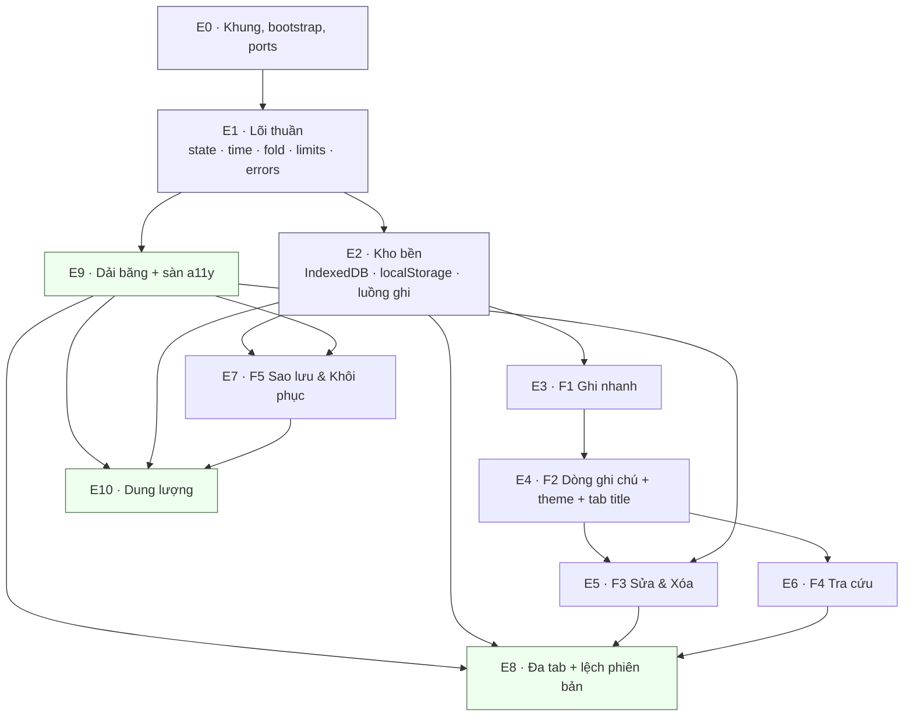

# Bản đồ chia việc — Ghi chú hàng ngày

Tài liệu này là **bước nối** giữa ARCHITECTURE-SPINE.md và `bmad-create-epics-and-stories`.
Nó nói **chia thành mấy khối, theo thứ tự nào, ranh giới ở đâu**. Nó **không** là danh sách story:
không acceptance criteria từng story, không ước lượng, không phân công.

Nguồn sự thật khi có xung đột: **ARCHITECTURE-SPINE.md**. PRD quyết *cái gì phải đúng*,
EXPERIENCE.md quyết *hành vi nhìn thấy được*, spine quyết *ranh giới mã*.

---

## 1. Nguyên tắc chia

### 1.1 Kết luận

**Chia theo tầng kiến trúc trước, theo feature sau — nhưng chỉ ở phần lõi.**
Cụ thể: hai epic đầu là **tầng ngang** (lõi thuần, rồi adapters/bootstrap); từ epic thứ ba trở đi
là **lát dọc theo feature** (F1…F5); ba epic cuối lại quay về **tầng ngang** cho những ràng buộc
xuyên suốt (a11y, phiên bản, dung lượng).

Hình dạng: **T ngược** — một nền ngang mỏng, nhiều cột dọc trên đó, một mái ngang mỏng.

### 1.2 Lập luận từ spine

| Bằng chứng trong spine | Suy ra |
| --- | --- |
| AD-2: `core/` không được chạm `window`/`document`/`indexedDB`; mọi module `core/` phải có test Vitest chạy ở Node | Lõi **kiểm chứng được mà không cần view**. Nếu chia thuần theo feature, mỗi feature sẽ tự kéo theo một mẩu `fold.js`/`time.js`/`limits.js` của riêng nó, và AD-5 (một hàm `fold` duy nhất) cùng AD-14 (mọi hằng số ở đúng một chỗ) sẽ vỡ ngay ở epic thứ hai |
| AD-4, AD-5, AD-14: mỗi thứ có **một** nơi duy nhất (`time.js`, `fold.js`, `limits.js`) | Những thứ "một nơi duy nhất" phải được xây **một lần, trước**, không được là sản phẩm phụ của một feature |
| AD-1: state chỉ đổi trong action ở `core/` | Khối state và bộ khung action là hạ tầng, không thuộc feature nào. Feature chỉ *thêm action* vào khung đã có |
| AD-8: hai luồng ghi (đổi sự tồn tại vs tự lưu) áp cho **mọi** feature ghi | Nếu F1 tự phát minh luồng ghi rồi F3 phát minh lại, hai luồng sẽ lệch. Luồng ghi thuộc epic nền |
| AD-6: đọc IndexedDB chỉ ở hai chỗ — khởi động và nhận BroadcastChannel | Việc nạp state khởi động là **một** việc, không phải năm việc chia theo feature |
| Capability → Architecture Map của spine ánh xạ F1…F5 vào các file **khác nhau** ở tầng view và action | Sau khi nền có rồi, các feature **tách rời được thật sự** và chạy song song được |
| AD-20: "sàn a11y trôi mất giữa các story vì không story nào nhận nó" | Sàn a11y phải là **epic riêng có chủ**, không phải một dòng checklist gắn đuôi mỗi feature |

### 1.3 Vì sao không chia thuần theo tầng

Nếu chia thuần ngang (core hết → ports hết → adapters hết → view hết), không có gì **dùng được**
cho tới epic cuối. PRD §10 SM-1 ("vẫn còn dùng sau một tháng") và SM-5 (đi trọn vòng BMAD) đòi
một sản phẩm chạy sớm. Vì vậy sau nền, mỗi epic feature phải là **lát dọc kết thúc bằng thứ Nam
bấm được**, kể cả khi lát đó chỉ có một hàng nút xấu.

### 1.4 Vì sao không chia thuần theo feature

Vì AD-1, AD-2, AD-8, AD-14, AD-17, AD-18 đều là **hợp đồng dùng chung**. Một hợp đồng dùng chung
mà được "khám phá dần" qua năm feature thì đến feature thứ ba nó đã có ba dị bản. Đây chính là
kiểu hỏng mà mỗi AD viết ở dòng **Prevents** của nó.

### 1.5 Quy tắc ranh giới (áp cho mọi epic bên dưới)

| Quy tắc | Trọng tài |
| --- | --- |
| Một epic **không** được thêm hằng số ngưỡng ngoài `core/limits.js` | AD-14 |
| Một epic **không** được thêm mã lỗi ngoài bảng đóng | AD-18 |
| Một epic **không** được thêm nguồn thứ tám cho dải băng | AD-17 |
| Một epic view **không** được ghi thẳng vào state | AD-1 |
| Một epic **không** được cho `core/` biết trình duyệt | AD-2 |
| Một epic **không** được lưu state tầng C xuống kho bền | AD-3 |

---

## 2. Danh sách epic đề xuất

**11 epic.** E0–E1 là nền, E2–E7 là feature, E8–E10 là mái ngang.

### E0 · Khung dự án, bootstrap, ports và adapters rỗng

| | |
| --- | --- |
| **Mục tiêu** | Dựng đúng cây thư mục của spine, một `index.html` tải được trên HTTPS, và `main.js` nối adapter thật vào port — chưa cần adapter nào làm việc thật. |
| **Gánh FR/NFR** | NFR-4, NFR-7, NFR-8, NFR-1 (đường cơ sở) |
| **AD chi phối** | AD-2, AD-9, AD-12, AD-19 (script theme nội tuyến), Structural Seed |
| **Phải xong trước** | *(không có — đây là gốc)* |
| **Xong khi** | Cây thư mục khớp Structural Seed; `npm test` chạy Vitest được; trang mở qua HTTP localhost và qua GitHub Pages tại `https://truongthanhnam.github.io/bmad/`; tab Network sau khi tải xong **không có request nào**; mở bằng `file://` được ghi rõ trong README là cấm; `main.js` là file duy nhất import từ `adapters/`. |

### E1 · Lõi thuần: state, hằng số, thời gian, bỏ dấu, mã lỗi

| | |
| --- | --- |
| **Mục tiêu** | Có một khối state duy nhất, một bộ action rỗng có kỷ luật, và bốn module thuần mà mọi epic sau đều gọi. |
| **Gánh FR/NFR** | FR-2, FR-7, FR-18, NFR-6, NT-4; nền cho FR-12, FR-13, FR-16 |
| **AD chi phối** | AD-1, AD-2, AD-4, AD-5, AD-13, AD-14, AD-18 |
| **Phải xong trước** | E0 |
| **Xong khi** | `core/time.js`, `core/fold.js`, `core/limits.js`, `core/errors.js`, `core/state.js` tồn tại và mỗi file có test Vitest **chạy được ở Node, không giả lập trình duyệt**; test bất biến của AD-5 (`fold(t).length === t.length` và khớp vị trí từng ký tự trên bộ chữ tiếng Việt có `đ`/`Đ`) xanh; test AD-4 chứng minh sắp xếp trên `localStamp` đúng khi hai ghi chú có offset khác nhau; grep toàn `core/` không ra `window`, `document`, `indexedDB`; grep toàn repo không ra một ngưỡng số nào nằm ngoài `limits.js`. |

### E2 · Kho bền: IndexedDB, localStorage, luồng ghi và nạp khởi động

| | |
| --- | --- |
| **Mục tiêu** | Ghi chú và bản nháp xuống được đĩa, đọc lại được lúc khởi động, và luồng ghi của AD-8 tồn tại **một lần** cho mọi feature sau. |
| **Gánh FR/NFR** | FR-3 (phần lưu trữ), NFR-3, NFR-8 |
| **AD chi phối** | AD-3, AD-6, AD-8, AD-9, AD-13 |
| **Phải xong trước** | E1 |
| **Xong khi** | DB `ghichu` v1 có store `notes` (index `localDate`) và `drafts`; bản ghi `notes` có **đúng năm trường** của AD-13; khởi động nạp toàn bộ `notes` vào RAM đã sắp giảm dần theo `localStamp`; quy tắc khởi động bản nháp của AD-3 chạy **trong một transaction `readwrite` duy nhất** (4 bước: sinh/nhận `tabId`, dùng bản của mình, nhận nhiều nhất một bản bỏ lại quá `DRAFT_STALE_MS`, xóa bản rỗng); `localStorage` chỉ mang đúng ba key `ghichu.theme`, `ghichu.lastBackupAt`, `ghichu.persistDenied`; adapter ném `Error` có `code` thuộc AD-18 và **không** gọi vào view; danh sách thử tay ghi trong README. |

### E3 · F1 — Ghi nhanh: ô soạn thảo, bản nháp, chốt

| | |
| --- | --- |
| **Mục tiêu** | Nam mở trang là gõ được, chữ tự lưu, `Ctrl+Enter` biến bản nháp thành ghi chú. |
| **Gánh FR/NFR** | FR-1, FR-2, FR-3, FR-4, FR-18; NFR-1, NT-1 |
| **AD chi phối** | AD-1, AD-3, AD-4, AD-8, AD-14, AD-15 (gọi `xoaHetDieuKien`), AD-16 |
| **Phải xong trước** | E2 |
| **Xong khi** | Con trỏ nằm sẵn trong ô soạn thảo lúc tải xong, không nút "Tạo mới"; `Enter` xuống dòng, `Ctrl+Enter` chốt, bản nháp rỗng thì `Ctrl+Enter` không làm gì; tự lưu debounce `AUTOSAVE_MS` với kỷ luật `seq` của AD-8 (hẹn lỗi thời bị bỏ); `chotGhiChu` ghi `notes` **cùng transaction** với việc làm rỗng `drafts` của tab này; đóng tab đột ngột rồi mở lại, bản nháp trở lại nguyên trạng; vượt `MAX_NOTE_CHARS` cho `code = TOO_LONG`, **không cắt im lặng**; state **không có** trường nào nghĩa "đang lưu"/"đã lưu". |

### E4 · F2 — Dòng ghi chú: render, lưới, khung nhìn mặc định, theme, tab title

| | |
| --- | --- |
| **Mục tiêu** | Những gì đã chốt hiện ra thành lưới hôm nay, và view là hàm thuần của state. |
| **Gánh FR/NFR** | FR-6, FR-7, FR-8, FR-9; NFR-1, NT-3, NT-4, `[OVERRIDE-1]`, `[OVERRIDE-2]` |
| **AD chi phối** | AD-1, AD-3 (tầng C), AD-6, AD-15, AD-16, AD-19 |
| **Phải xong trước** | E3 |
| **Xong khi** | Khung nhìn mặc định chỉ ghi chú có `localDate` = hôm nay, mới nhất ở ô trên-cùng-trái, đọc trái→phải rồi xuống hàng; mẩu thu gọn có cùng chiều cao trần `COLLAPSED_LINES`; mở rộng tại chỗ, và trạng thái mở rộng **mất** sau khi tải lại (A-3); trạng thái rỗng vẽ **không một chữ nào**; tab title là số ghi chú **của hôm nay**, không phải số mẩu đang hiển thị; theme đặt lên `<html>` bởi script đồng bộ nội tuyến trong `<head>`, không nháy màu sai; view không ghi vào state ở bất kỳ đâu. |

### E5 · F3 — Sửa & Xóa

| | |
| --- | --- |
| **Mục tiêu** | Ghi chú đã có sửa được tại chỗ và xóa được qua một bước xác nhận. |
| **Gánh FR/NFR** | FR-5, FR-10, FR-11; NT-2, NT-4 |
| **AD chi phối** | AD-1, AD-4, AD-5, AD-8, AD-16, AD-20 (mục 2 — giam focus) |
| **Phải xong trước** | E4 |
| **Xong khi** | Click 1 mở rộng, click 2 vào chế độ sửa — **hai nhịp không bao giờ nhập một**; sửa tự lưu ≤ 1 giây, `createdAt` và vị trí không đổi; `textFolded`/`localDate` được **tính lại ở mọi lần ghi**; xóa hết ký tự rồi rời khỏi mẩu thì mẩu biến mất **không hỏi**; xóa đi qua hộp thoại có `hủy`/`xóa`, `Esc` và click ra ngoài = hủy, focus mặc định vào `hủy`, focus trả về đúng nút xóa vừa bấm; `suaGhiChu`/`xoaGhiChu` hủy hẹn tự lưu đang treo của mục tiêu trước khi làm gì khác. |

### E6 · F4 — Tra cứu: từ khóa, lọc ngày, khối điều kiện

| | |
| --- | --- |
| **Mục tiêu** | Con đường duy nhất tới mọi thứ cũ hơn hôm nay, chạy đồng bộ trong RAM. |
| **Gánh FR/NFR** | FR-12, FR-13, FR-14; NFR-2, NFR-6, NT-3 |
| **AD chi phối** | AD-5, AD-6, AD-14, AD-15, AD-16 |
| **Phải xong trước** | E4 (song song được với E5) |
| **Xong khi** | Điều kiện là **một** giá trị `{keyword, date}` trong state, đổi bởi đúng `datDieuKien`/`xoaHetDieuKien`; `query.js` trả `{items, total}` — `items` cắt còn `MAX_RESULTS`, `total` là số khớp thật; view lấy `total` cho hàng chip, **không** đếm `items.length`; `phan quyen` khớp và tô đúng vị trí bên trong `Phân quyền`; chuỗi ngày sai định dạng thì `date` giữ nguyên và lưới **không đổi**, lỗi hiện tại chỗ ở ô ngày chứ không qua dải băng; bảng mô hình trạng thái §5.4 của PRD khớp từng dòng; với 2.000 ghi chú, lọc và tìm ≤ 200 ms; gõ vào ô soạn thảo xóa hết điều kiện, gõ vào ô tìm kiếm thì không. |

### E7 · F5 — Sao lưu & Khôi phục

| | |
| --- | --- |
| **Mục tiêu** | Xuất được một file chứa toàn bộ ghi chú, và nạp lại được nó theo lối gộp nguyên tử. |
| **Gánh FR/NFR** | FR-15, FR-16, FR-17, FR-18 (trần ở cửa vào file); UJ-3 |
| **AD chi phối** | AD-4, AD-8, AD-11, AD-13, AD-14, AD-16 (ngoại lệ duy nhất), AD-17, AD-18 |
| **Phải xong trước** | E2 (song song được với E5, E6) |
| **Xong khi** | File đúng hình dạng `{schemaVersion:1, exportedAt, notes:[{id,createdAt,text}]}`, tên `ghi-chu-hang-ngay-YYYY-MM-DD.json`, **không** chứa `localDate`/`textFolded`, **không** chứa bản nháp; nạp đi qua hai pha — kiểm tra toàn bộ trước, rồi ghi trong **một** transaction; một file sai bất kỳ chỗ nào bị từ chối mà **không ghi một byte**; gộp theo `id`, không bao giờ xóa hay ghi đè; `backup.js` trả `{added, skipped}` và microcopy hiện hai con số thật; `ghichu.lastBackupAt` cập nhật ở **cả hai** đường (xuất, và nạp khi `exportedAt` mới hơn); dòng nhắc FR-17 ở chân trang, **không** đi qua dải băng. |

### E8 · Đa tab và lệch phiên bản

| | |
| --- | --- |
| **Mục tiêu** | Hai tab không ghi đè nhau, không ăn bản nháp của nhau, và mã cũ hỏng ồn ào chứ không hỏng im lặng. |
| **Gánh FR/NFR** | FR-20, FR-3, NFR-3; UJ-1 |
| **AD chi phối** | AD-3, AD-7, AD-13, AD-17 (ưu tiên 1), AD-18, AD-21 |
| **Phải xong trước** | E2 và E9 (cần dải băng để nói) — nội dung đồng bộ cần E3…E7 đã ghi đúng |
| **Xong khi** | Đúng một kênh `BroadcastChannel('ghichu')` và đúng một hình dạng bản tin bốn trường, đúng hai `type`; bản tin **không bao giờ mang nội dung** — tab nhận đọc lại từ kho bền; tab bỏ qua tin của chính mình; `notes-changed` phát sau **mọi** lần ghi `notes` thành công; **bản nháp không bao giờ phát tin và không bao giờ bị tab khác đụng** khi tab chủ còn nhịp tim; `appVersion` khác → tab vào **chế độ chỉ đọc**, mọi action ghi trả `VERSION_SKEW`, hẹn tự lưu bị hủy, dải băng ưu tiên 1 không đóng được; không có khóa tab, không có dải băng "đóng tab này". |

### E9 · Dải băng, mã lỗi ra màn hình, và sàn accessibility

| | |
| --- | --- |
| **Mục tiêu** | Mọi thứ xấu đi ra đúng một ô theo đúng một thứ tự ưu tiên, và sáu mục sàn a11y có chủ. |
| **Gánh FR/NFR** | FR-11 (focus), FR-16, FR-19, FR-20; Accessibility Floor (6 mục) |
| **AD chi phối** | AD-8, AD-16, AD-17, AD-18, AD-20 |
| **Phải xong trước** | E1 (cần `errors.js`); nên xong **trước** E5, E7, E8, E10 vì cả bốn đều đổ vào đây |
| **Xong khi** | `view/banner.js` là nơi duy nhất vẽ dải băng, đọc **một** giá trị state tầng C; bảng bảy nguồn của AD-17 hiện thực đúng, và một thông báo ưu tiên thấp **không** thay được thông báo ưu tiên cao đang hiện; grep `style.css` không ra `outline: none` và không ra một giá trị màu viết thẳng nào ngoài token; mọi điều khiển chỉ có ký hiệu (`✕`, icon lịch) có nhãn chữ; thứ tự tab khớp danh sách của EXPERIENCE.md và không có `tabindex` dương; phóng 200% rớt về một cột, không cắt chữ, không đẩy điều khiển ra ngoài; **mọi** chuyển động nằm trong một khối `@media (prefers-reduced-motion: no-preference)` duy nhất. |

### E10 · Dung lượng: xin lưu trữ bền và cảnh báo trước ngưỡng

| | |
| --- | --- |
| **Mục tiêu** | Trình duyệt không lặng lẽ dọn dữ liệu, và Nam biết trước khi hết chỗ chứ không phải lúc đã hỏng. |
| **Gánh FR/NFR** | FR-19, FR-17 (ngưỡng nhắc hạ xuống 3 ngày), NFR-3; PRD Open Question 3 |
| **AD chi phối** | AD-8, AD-10, AD-14, AD-17, AD-18 |
| **Phải xong trước** | E2, E7 (lời khuyên "xuất sao lưu" phải có chỗ để bấm), E9 |
| **Xong khi** | `navigator.storage.persist()` được gọi ở **mỗi** lần khởi động cho tới khi trả `true`; bị từ chối thì `ghichu.persistDenied` được ghi và `BACKUP_NUDGE_DAYS` hạ 7 → 3; sau mỗi lần chốt/sửa/nạp lại, `estimate()` được đọc và cảnh báo khi `usage/quota ≥ 0.80` **hoặc** `quota - usage < 50 MB` — **cả hai vế**, không chỉ vế phần trăm; `QuotaExceededError` thật vẫn đi qua đường AD-8 với `code = QUOTA` và dải băng ưu tiên 2 không đóng được cho tới khi một phép ghi sau đó thành công; `estimate()` **không bao giờ** được dùng để quyết định có ghi hay không. |

---

## 3. Sơ đồ phụ thuộc

Mũi tên là **"phải xong trước"**. E5, E6, E7 không phụ thuộc lẫn nhau — ba cột dọc chạy song song
được sau khi E4 xong (E7 chỉ cần E2).

---

## 4. Đường đi ngắn nhất tới "dùng thật được"

"Dùng thật được" = Nam bỏ Notepad++ cho việc ghi nhanh hàng ngày (SM-1), tức UJ-1 chạy trọn vẹn
và dữ liệu không có đường mất trắng.

| Vòng | Epic | Nam làm được gì |
| --- | --- | --- |
| **Vòng 1 — tối thiểu dùng được** | E0 → E1 → E2 → E3 → E4 | Mở tab, gõ, `Ctrl+Enter`, thấy lưới hôm nay. UJ-1 trọn vẹn. |
| **Vòng 1b — bắt buộc kèm theo** | E7 | Xuất được file sao lưu. **Không được tách khỏi vòng 1**: từ giây phút Nam bắt đầu ghi thật, dữ liệu chỉ nằm trong một trình duyệt của một máy công ty, và F5 là lối thoát **duy nhất** khỏi kịch bản `Clear browsing data`. |
| **Vòng 2 — dùng được lâu** | E5, E6 | Sửa/xóa, và UJ-2 (tra cứu). |
| **Vòng 3 — chịu được thực tế** | E9, E8, E10 | Lỗi nói được, đa tab an toàn, hết chỗ thì biết trước. |

**Tối thiểu tuyệt đối để Nam bắt đầu dùng hàng ngày: E0, E1, E2, E3, E4, E7 — sáu epic.**

**Đến sau được, và lý do:**

| Đến sau | Vì sao chịu được |
| --- | --- |
| E6 · Tra cứu | Tháng đầu chưa có dữ liệu cũ để tra. Nhưng **không được lùi quá tháng đầu** — PRD §5.4 nói rõ F4 không được xếp sau và không được cắt bớt; thiếu nó là **mất truy cập** vào gần như toàn bộ dữ liệu, không phải "kém tiện". |
| E5 · Sửa & Xóa | Ghi chú sai thì ghi lại một cái mới; xấu nhưng không mất dữ liệu. |
| E8 · Đa tab | Chỉ hỏng khi Nam thật sự mở hai tab. Rủi ro thật, nhưng có thể tránh bằng thói quen trong vài tuần đầu. |
| E10 · Dung lượng | 2.000 ghi chú × 20.000 ký tự vẫn xa quota Chromium. Nhưng nó là **phanh cuối** của NFR-3, nên không được trôi qua vòng 3. |

**Không được lùi sang "sau"**, dù nghe như hạ tầng: E9. Không có nó thì E5 (hộp thoại xóa), E7
(kết quả nạp), E8 (`VERSION_SKEW`) và E10 (cảnh báo) đều **không có chỗ nói**, và mỗi epic sẽ tự
chế một chỗ nói riêng — đúng kiểu hỏng AD-17 viết ra để chặn.

---

## 5. Những chỗ dễ xây lệch nhất giữa hai epic

| # | Ranh giới | Xây lệch trông như thế nào | Trọng tài |
| --- | --- | --- | --- |
| 1 | **E3 ↔ E6** — ô soạn thảo vs khối điều kiện | E3 tự nhớ "đang có điều kiện không" để đổi placeholder, E6 giữ một bản khác. Hai nửa lệch, bảng §5.4 PRD không bao giờ khớp | **AD-15** — điều kiện là **một** giá trị, đổi bởi đúng hai action; `chotGhiChu` gọi `xoaHetDieuKien()` như bước đầu tiên |
| 2 | **E4 ↔ E6** — số kết quả | E4 vẽ hàng chip bằng `items.length` (đã cắt còn 50) thay vì `total` | **AD-14** — `query.js` trả `{items, total}`; cấm view tự đếm |
| 3 | **E3 ↔ E5** — hai luồng tự lưu | Bản nháp và ghi chú đang sửa mỗi bên một debounce, một bên có `seq` một bên không → hẹn cũ hồi sinh chữ đã chốt | **AD-8** — mỗi mục tiêu tự lưu mang `seq`; `chotGhiChu`/`xoaGhiChu` hủy hẹn treo trước; chốt + làm rỗng `drafts` trong **một** transaction |
| 4 | **E2 ↔ E8** — bản nháp và đồng bộ | E8 làm "nạp lại state" cho gọn, quét luôn cả `drafts` → xóa mất bản nháp tab kia (FR-20 cấm bằng chữ) | **AD-7** + **AD-3 tầng B** — chỉ `notes` đồng bộ; bản nháp không phát tin, không bị tab khác đọc/ghi khi còn nhịp tim |
| 5 | **E5/E7/E10 ↔ E9** — ai được nói | Ba nguồn cùng đẩy vào dải băng; cảnh báo dung lượng (ưu tiên 7) đè mất lỗi `QUOTA` (ưu tiên 2) | **AD-17** — bảng bảy nguồn, ưu tiên thấp không thay được ưu tiên cao. Thêm nguồn = sửa bảng **trước** |
| 6 | **E2 ↔ E9** — adapter báo lỗi | Adapter `console.error` hoặc gọi thẳng `banner.js` cho nhanh | **AD-8** + đồ thị import (không có cạnh `adapters → view`) — lỗi đi ngược lên action rồi mới ra view |
| 7 | **E1 ↔ E6/E7** — khóa thời gian | `query.js` so sánh trên `createdAt` (có offset) còn `backup.js` dùng `new Date()` → hai kiểu sắp xếp | **AD-4** — chỉ `localStamp`/`localDate`; cấm so chuỗi trên `createdAt`, cấm `new Date(createdAt)` |
| 8 | **E1 ↔ E6** — bỏ dấu hai đầu | E2 fold lúc ghi, E6 fold lại lúc tìm bằng một đoạn khác → gõ đúng mà không ra kết quả | **AD-5** — một hàm `fold()` duy nhất, thứ tự `đ→d` trước NFD, cộng bất biến độ dài/vị trí |
| 9 | **E3/E5/E7 ↔ E1** — trần độ dài | Chặn ở ô soạn thảo nhưng quên ở chế độ sửa hoặc ở file nạp | **AD-14** — kiểm ở `core/`, tại **cả ba** cửa vào |
| 10 | **E4 ↔ E8** — theme và phiên bản | Script theme nội tuyến bị coi là "lệ ngoại nên viết đâu cũng được", trôi vào `app/` | **AD-19** — ngoại lệ duy nhất của AD-2, và **phải** nằm trong `index.html` |
| 11 | **E4 ↔ mọi epic** — im lặng khi thành công | Ai đó thêm chỉ báo "đã lưu" vì nó *nghe có vẻ hữu ích* | **AD-16** — state **không có** trường mang nghĩa đó, nên view không có gì để vẽ |
| 12 | **E8 ↔ E3/E5** — chế độ chỉ đọc | E8 chỉ hiện cảnh báo mà vẫn cho ghi; RAM lỗi thời đè lên bản ghi của mã mới | **AD-21** — chỉ-đọc chứ không phải chỉ-cảnh-báo; hẹn tự lưu bị hủy |

---

## 6. Epic hạ tầng dễ bị bỏ quên

Bốn khối dưới đây **không thuộc feature nào**, nên nếu không ghi thành epic riêng thì không story
nào nhận, và chúng sẽ trôi tới retrospective.

| Khối | Epic | Vì sao dễ mất | Dấu hiệu nó đã bị mất |
| --- | --- | --- | --- |
| **Bootstrap và adapters** | E0 (+ E2) | Không có màn hình nào để demo, nên nó luôn thua một feature nhìn thấy được khi tranh thứ tự | `core/` đã bắt đầu import `indexeddb.js`; nhiều hơn một file nối adapter vào port |
| **Sàn a11y (AD-20)** | E9 | Sáu mục nghe như "checklist chú ý", và spine đã nói thẳng: *"sàn a11y trôi mất giữa các story vì không story nào nhận nó"* | `outline: none` xuất hiện; màu viết thẳng trong `style.css`; hộp thoại xóa không giam focus; hoạt ảnh nằm ngoài khối `prefers-reduced-motion` |
| **Phát hiện lệch phiên bản (AD-21)** | E8 | Chỉ hỏng khi Nam để tab mở nhiều ngày rồi deploy — không bao giờ gặp lúc phát triển | `APP_VERSION` tồn tại nhưng không đi trong bản tin; nhận tin lệch mà chỉ hiện cảnh báo, vẫn cho ghi; quên bump khi deploy (thuộc checklist deploy của E0) |
| **Cảnh báo dung lượng (AD-10)** | E10 | Ngưỡng gần như không bao giờ nổ trên máy phát triển, nên "chắc để sau" | Chỉ gọi `persist()` một lần rồi bỏ; chỉ kiểm vế `usage/quota ≥ 0.80` mà bỏ vế `quota - usage < 50 MB`; dùng `estimate()` để quyết định có ghi hay không |

Ngoài bốn khối trên, hai việc nhỏ **không có epic riêng** và phải được gắn tường minh:

- **Bump `APP_VERSION` mỗi lần deploy** → checklist deploy trong README, thuộc E0, được E8 dựa vào.
- **Danh sách thử tay cho `adapters/`** → Consistency Conventions của spine nói `adapters/` không có
  test tự động; danh sách đó là bằng chứng duy nhất, thuộc E2.

---

## 7. Bàn giao cho `bmad-create-epics-and-stories`

- Số epic vào: **11** (E0…E10).
- Thứ tự sinh story: theo sơ đồ §3, ưu tiên đường vòng 1 của §4.
- Mỗi story phải trích **AD** mà nó tuân theo; §5 là danh sách kiểm khi story nằm vắt qua hai epic.
- Không story nào được phép thêm hằng số, mã lỗi, hay nguồn dải băng mới mà không sửa spine trước.
